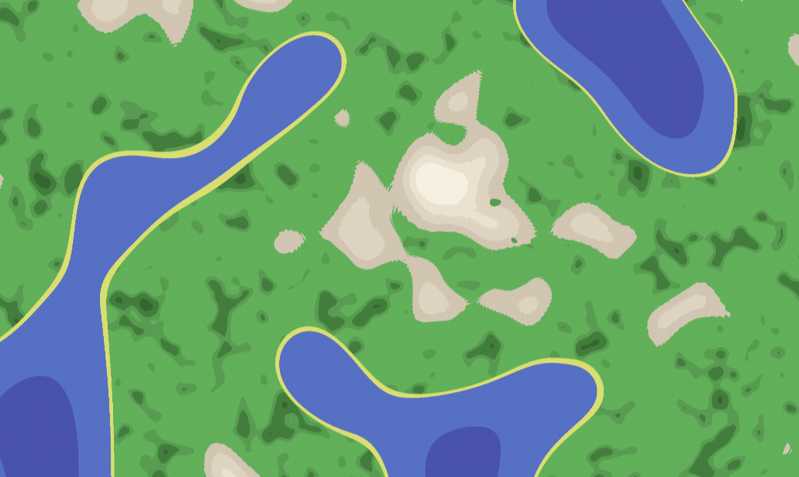
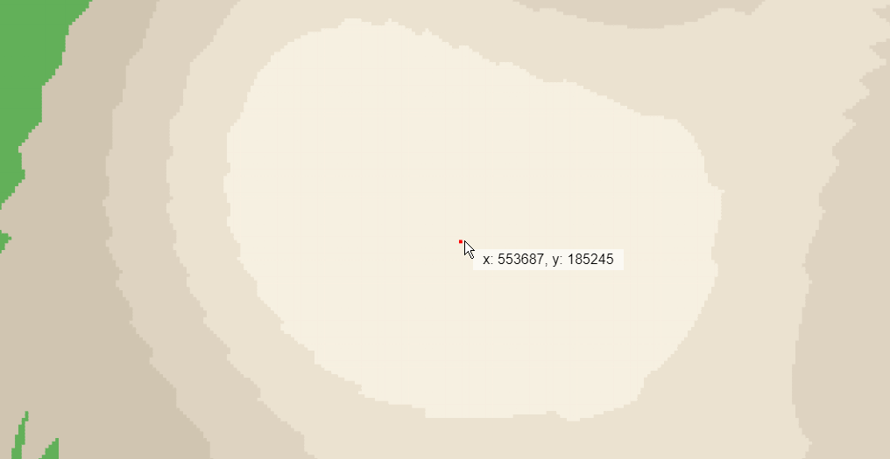
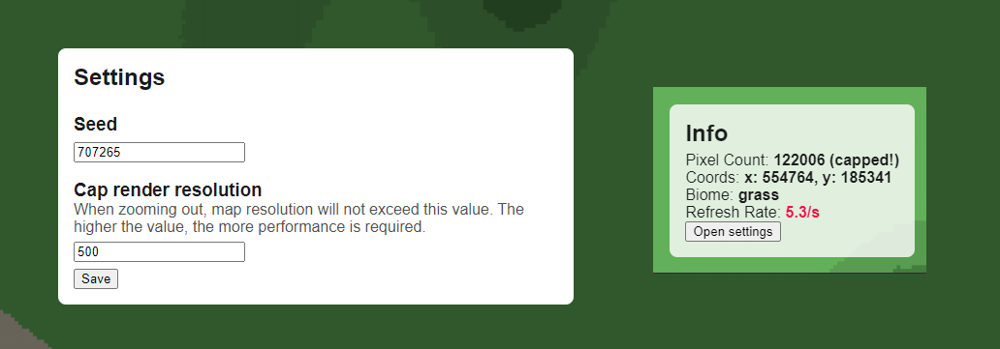

# Procedural World Generation
This project generates a procedurally generated world using the [Perlin Noise](https://en.wikipedia.org/wiki/Perlin_noise) algorithm. You can navigate the world using the arrow keys and the mouse. You can also use the mouse wheel to zoom in and out.

## Features
- Procedural world generation
- Zoom in and out using the mouse wheel
- Navigate the world using the arrow keys and the mouse
- Editable seed
- Browser URL is constantly updated with current seed, zoom level & position, so you can share or save your world
- Stats
- Settings (render resolution)

## Biomes
The world is generated using 3 'layers' of Perlin Noise. One for the oceans, one for the mountains, and one for the forests. These three layers are then combined into multiple biomes:

**Oceans:**
- Beach (sand)
- Coast (shallow water)
- Ocean (water)
- Deep Ocean (water)
- Abyss (water)

**Mountains:**
- Mountain (rock)
- Subalpine (rock)
- Alpine (rock)
- Snow (well, snow)

**Forests:**
- Vegetation (grass)
- Forest (trees)
- Dense Forest (lots of trees)

Everything else is set to 'grass'.

## Details
This projects uses no external libraries. It is written in pure JavaScript and uses the HTML5 canvas element to render the map. I made the whole thing in a single day, so it's not perfect. If you find any bugs/flaws, don't hesitate to open an issue or a pull request. Also, feel free to use this project however you want!